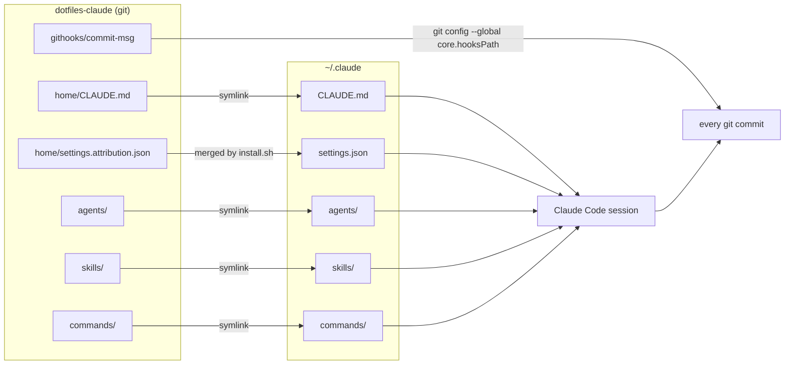

# dotfiles-claude

My [Claude Code](https://claude.com/claude-code) configuration, versioned:
global instructions, subagents, skills, a slash command, a git hook, and an
engagement template. This repo is the source of truth; `~/.claude` points here.

## How it reaches a session



Editing a file here changes the next session. No copy step, no reinstall.
`settings.json` is the exception: it stays a real file because it also holds
machine- and client-specific state, so `install.sh` merges the attribution
fragment into it and leaves every other key alone.

## Contents

| Path | What |
|---|---|
| `home/CLAUDE.md` | Global instructions: communication, code, Angular commits, docs |
| `home/settings.attribution.json` | Fragment that blanks commit and PR attribution |
| `agents/` | 7 subagents: IaC, Kubernetes/GitOps, code review, incidents, SRE audit, AI platform, pre-sales |
| `skills/` | 4 skills: `humanizer`, `doc-writer`, `sre-audit`, `presales-deliverables` |
| `commands/commit.md` | `/commit` — reads the diff, splits by subject, writes Angular messages |
| `githooks/commit-msg` | Strips AI trailers, then enforces the Angular header |
| `templates/CLAUDE.md.template` | Engagement CLAUDE.md to copy into a client repo |
| `install.sh` | Idempotent deployment |

Agents declare Claude Code tools in `tools:`; external CLIs run through `Bash`
and each agent lists the subcommands it may use. `gcloud`, `glab`, `kubectl`,
`helm`, `flux` and `argocd` are read-only everywhere: mutations go through IaC
or CI, never through an ad-hoc call. `presales-architect` has no `Bash` at all.

## Install

Requires a Linux or WSL2 filesystem (under `~`, never `/mnt/c`), `git`,
`python3`, and an SSH `private` host alias.

```sh
git clone git@private:mjebalidev/dotfiles-claude.git ~/Private/dotfiles-claude
cd ~/Private/dotfiles-claude
./install.sh
```

Then start a fresh session and run `/agents`.

| Flag | Effect |
|---|---|
| *(none)* | Links `agents`, `skills`, `commands`, `CLAUDE.md`; merges settings; sets `core.hooksPath` |
| `--no-git-hooks` | Same, without touching `core.hooksPath` |

Re-running is a no-op when everything is already in place. Anything in the way
is moved to `*.bak.<n>`; nothing is deleted.

## The commit hook

`core.hooksPath` is global, so the hook would otherwise hide each repo's own
`.git/hooks/commit-msg`. It runs that local hook first and honours its exit
code. Repos that set `core.hooksPath` themselves, which is what Husky does,
override the global value and never reach this hook — use `commitlint` with
`@commitlint/config-angular` there instead.

The hook removes `Co-Authored-By: Claude`, `Generated with … Claude` and
`Claude-Session:` lines, then checks the subject against:

```
^(build|chore|ci|docs|feat|fix|perf|refactor|test|revert)(\([a-z0-9._/-]+\))?!?: [^A-Z].{0,70}[^.]$
```

`Merge`, `Revert "`, `fixup!` and `squash!` subjects are exempt.

## SSH `private` host alias

The remote uses the `private` alias so `~/.ssh/config` decides which key and
account are used.

```
Host private
  HostName github.com
  User git
  IdentityFile ~/.ssh/private
  IdentitiesOnly yes
```

## What is not here

Nothing from `~/.claude` that is sensitive or machine-local: credentials,
`projects/`, `history.jsonl`, `sessions/`, and the rest of `settings.json`
including the `autoMode` environment block.
