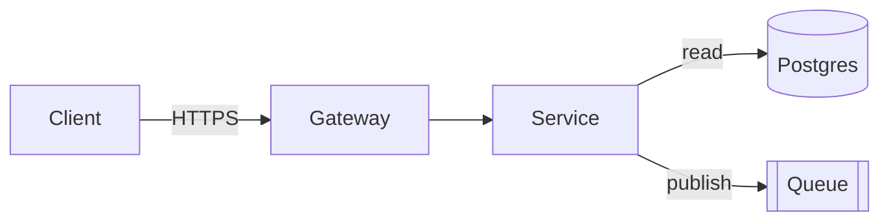

# Documentation

Document what someone would have to read the source to understand. If an IDE
tooltip or a `--help` output already says it, do not write it.

## Before writing

1. Read the source, the tests and the CI config. Documentation written from the
   file names is wrong within a week.
2. List what confused you. That list is the outline.
3. Find the why: the decisions, the tradeoffs, the behaviour that looks like a
   bug and is not.

## README

What, why, and running it in under five commands. Everything else goes in
`docs/`.

```markdown
# Name

One to three sentences: what this is and which problem it removes.

## Architecture
[Mermaid diagram]
Two or three sentences on how the pieces fit.

## Getting started
[under five commands, copy-paste safe]

## Configuration
[table]

## [Core concept]
Explain the concept and why it is shaped that way.
```

Never in a README: a function-by-function API reference, a list of exported
symbols, a usage example that only restates a type signature, a badge wall, a
"Conclusion", a "Key Takeaways", a roadmap nobody maintains.

## Diagrams

A diagram instead of a paragraph, not in addition to one. Keep it under 15
nodes; split rather than cram. Label the edges with what actually flows.

| Need | Diagram |
|---|---|
| Components and their relations | `flowchart` (`graph TB` / `LR`) |
| Who calls whom, in order | `sequenceDiagram` |
| Lifecycle, status fields, retries | `stateDiagram-v2` |
| Branching decision logic | `flowchart` with decision nodes |
| Entities and their keys | `erDiagram` |
| Phases and dependencies | `gantt` |



Render the Mermaid mentally before shipping it: an unparseable diagram is worse
than no diagram. Subgraphs mark trust boundaries.

## Tables

Configuration, environment variables, flags, exit codes, ports — always a
table, never prose.

| Variable | Required | Default | Effect |
|---|---|---|---|
| `DATABASE_URL` | yes | — | Postgres DSN; the service refuses to start without it |
| `LOG_LEVEL` | no | `info` | `debug` logs every query |

Say what happens when the value is wrong or missing. That is the part the code
hides.

## Examples

Only when they clarify something non-obvious. Three lines showing a pattern is
useful; twenty lines of getting-started that duplicates the types is not. Every
example must run as written: real command, real flags, output shown when it is
the point.

## Runbooks and ADRs

- Runbook: symptom → how to confirm it → the command to run → how to verify the
  fix → what to do if it fails. Imperative, no narrative.
- ADR: context → decision → consequences, including the ones you dislike.
  Record what was rejected and why; that is the part people come back for.

## Before returning

- [ ] Does any section only repeat what the code already states?
- [ ] Is the why written down, or only the what?
- [ ] Does getting-started work on a clean machine, in order?
- [ ] Is every diagram valid Mermaid and under 15 nodes?
- [ ] Is config in a table?
- [ ] Any filler heading, any paragraph a diagram would replace?

Tone: the `humanizer` skill.
